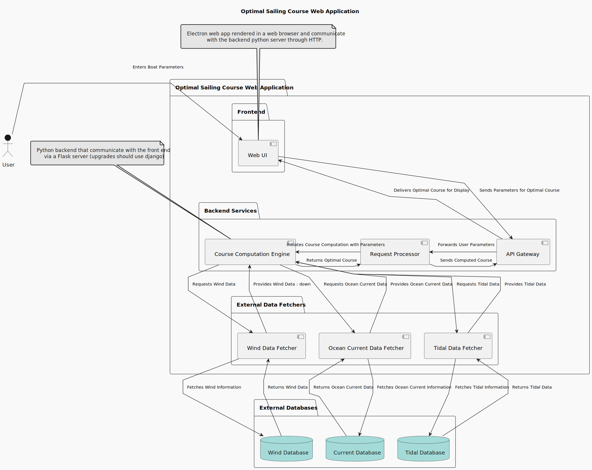
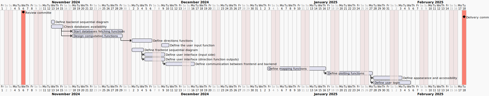

# winged-watch

Computes the best sailing course for a sail boat according to winds, ocean currents and the boat's draft.

This project is led by Gabriel Gostiaux, student in engineering at Institut of Optics in Palaiseau, FRANCE.

## Description

The application will work from data provided by

1) for bathymetric data : GEBCO <https://www.gebco.net/data_and_products/>
2) for wind predictions : AROME model from meteo-france <https://meteo.data.gouv.fr/datasets/65bd1247a6238f16e864fa80>
3) for ocean currents : AROME model from meteo-france <https://meteo.data.gouv.fr/datasets/65bd19226c4e3fcbf4948f99> (to check)
4) for tidal heightd : AROME model from meteo-france <https://meteo.data.gouv.fr/datasets/65bd17b9775b5222832d67a4>

## Specs

The goal of the app is to computes an optimal course for a sailing boat according to natural constraints (wind, tidal and ocean currents) and based on navigation rules.

1) the app should use (and show) the bathymetric map at different scales,
2) the app should use (and show) the wind forecast,
3) the app should use (and show) the ocean currents forecast,
4) the app should use (and show) the tidal heights forecast,
5) the app should use (and show) basics marine beacons,
6) the app should computes (and show) the optimal sailing course,
7) the app should provide a list of timed directions to follow the computed course.

## Conception

The vizualization side will be designed later on. For the computation side, a first component diagram has been designed to illustrate how the app will respond to the specifications 2, 3, 4, 5, 7 (see below).

## Work program

The estimate work program is presented below. It needs to be revised regularly.

## Testing

Testing of fetching functions will include integrity testing through data occurency checking with the source.
Testing of computation will be compared with analytical computation.
Testing of communication between frontend and backend will be designed with simple messages and print functions.
Timed directions will be confronted with the plotted optimal course.
Tidal heights, ocean currents and wind forecast can be confronted with classic analytic maps, observation and official forecast at reference harbors, and direct computation.
